# Lord of the Reps (Prog 2: Represent)

This is essentially an app that will allow you to keep up with information about representatives in Congress!

## Authors

Kevin Chow ([kvn_chow@berkeley.edu](mailto:kvn_chow@berkeley.edu))

## Demo Videos

* Part 1a: See [CS 160: part of 2nd Project] (https://vimeo.com/157691591)
* Part 1b: See [CS 160 Project 2] (https://www.youtube.com/watch?v=R2p_RlZ3jIw)
* Part 2: See [Berkeley CS 160 project 2 continued] (https://www.youtube.com/watch?v=gcQ46gbgzC4)

## Screenshots

Original design:

App with dummy info:
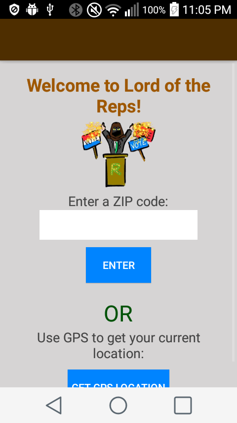
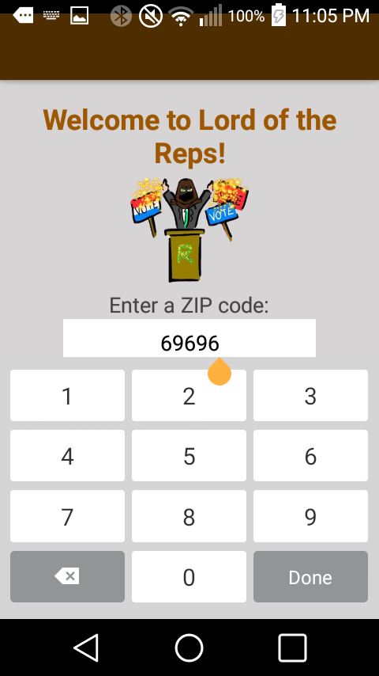
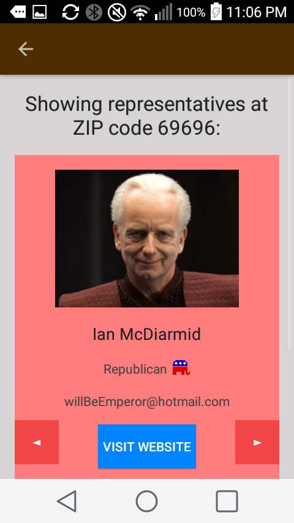
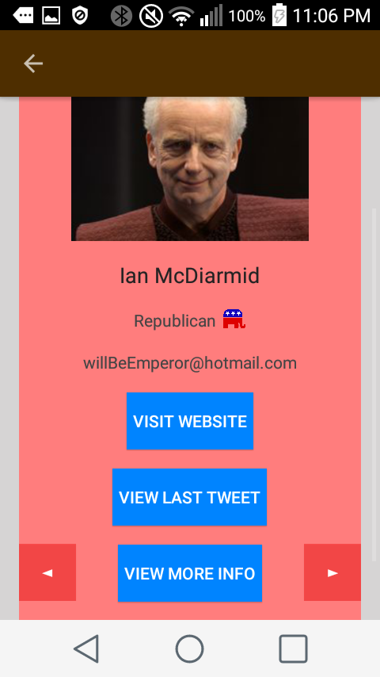
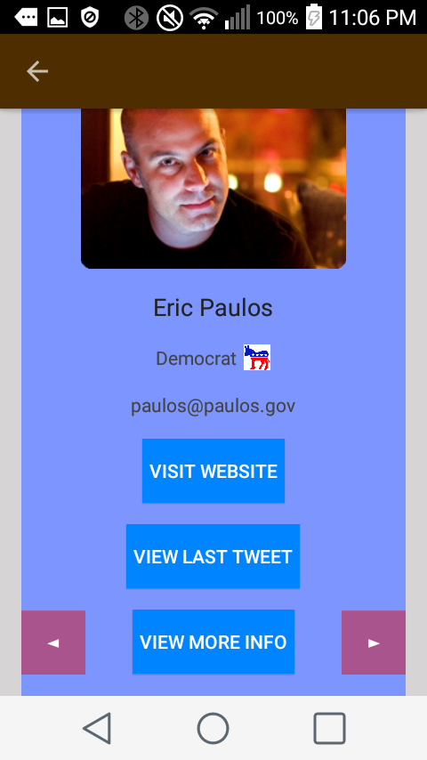
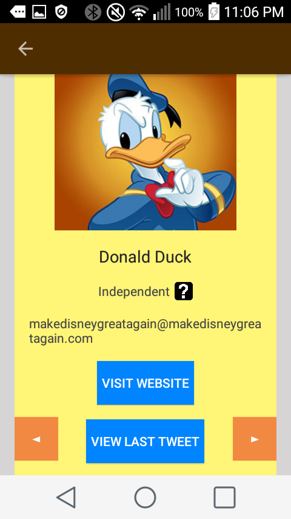
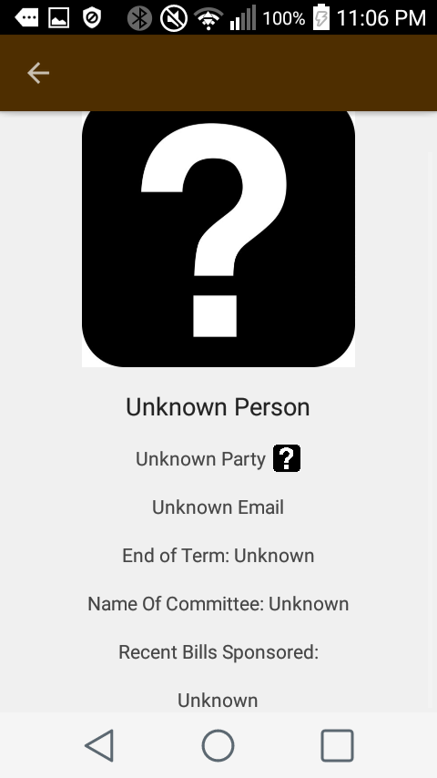

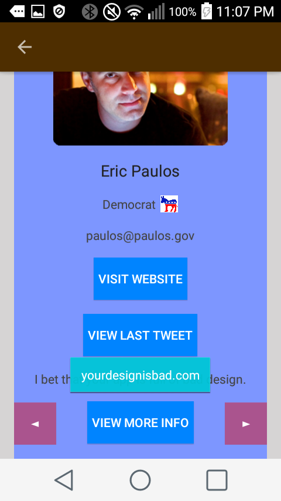
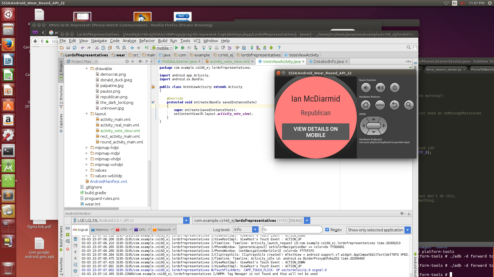
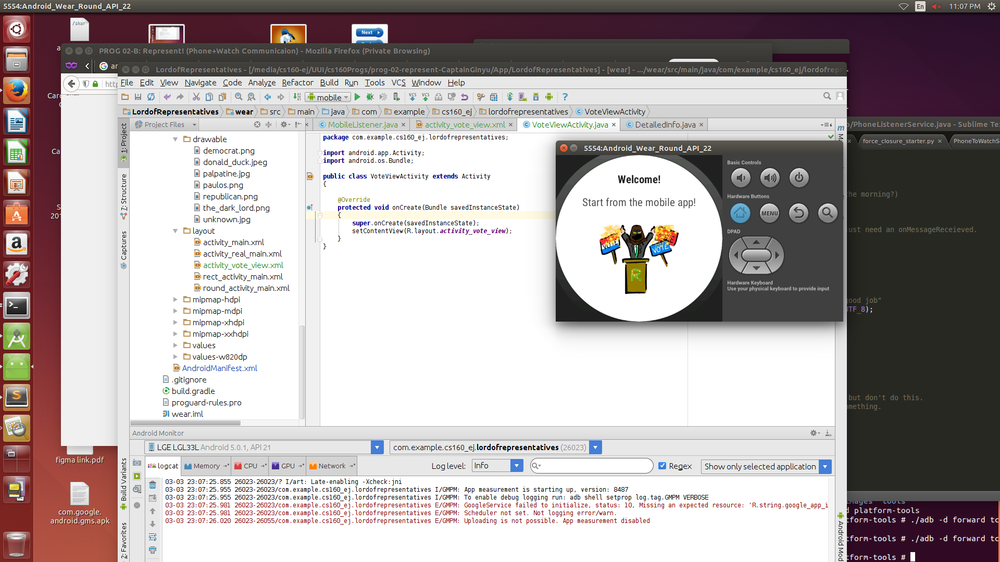

App with less dummy info:
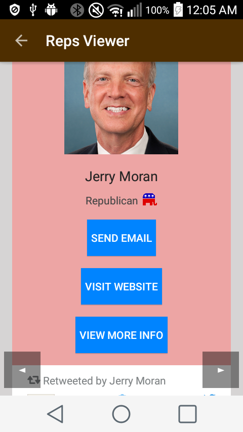
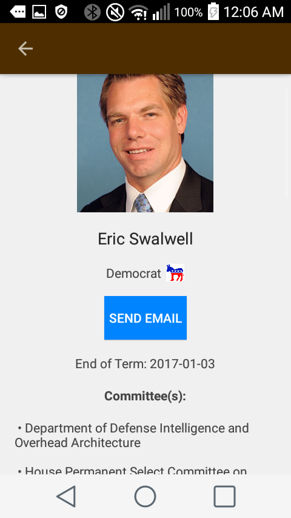

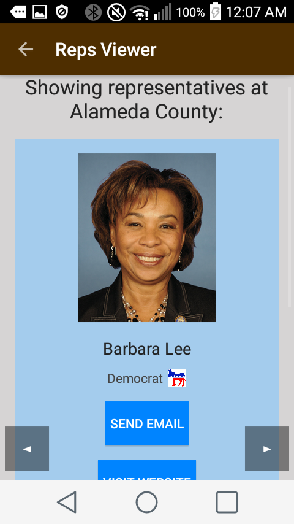
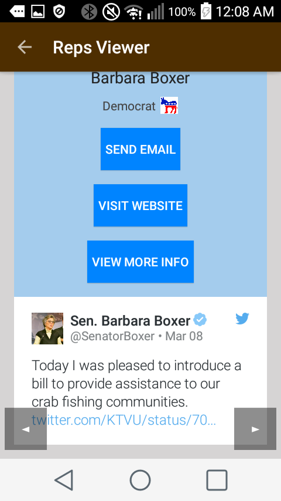

As you may notice, I changed some aspects of design from my original plan.  Some text (like email text) were replaced with buttons.

## Acknowledgments
 * Catnip sample code provided by the CS 160 staff!
 * Various answered questions on StackOverflow
 * Android documentation
### Images used
* [http://images.clipartpanda.com/ms-office-clipart-292945.jpg] (http://images.clipartpanda.com/ms-office-clipart-292945.jpg)
* [http://images.all-free-download.com/images/graphicmedium/hooded_cartoon_character_ii_117679.jpg] (http://images.all-free-download.com/images/graphicmedium/hooded_cartoon_character_ii_117679.jpg)
* Other random images from Google Image
